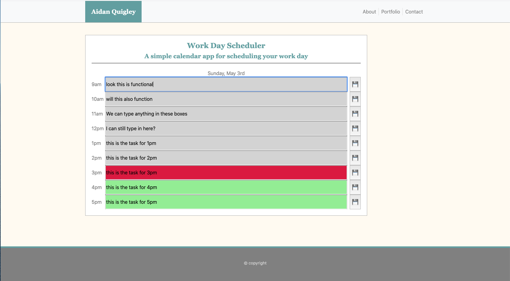

# 05 Third-Party APIs: Work Day Scheduler

The goal of this project was to create a workday scheduler. This scheduler would have the hours listed in blocks from 9am to 5pm. A user would be able to enter data/tasks into these boxes and then click a save button on the right hand side which would save the tasks to local storage. Upon refreshing the page all tasked saved into local storage would populate the page. Additionally, the current date would be listed at the top of the scheduler. boxes for time peroids that have passed would be greyed out, the current hour would be highlighted in red and future hour boxes would be highlighted in green.

To achieve these goals we used a number of methods. The jQuery library was the workhorse of our DOM manipulation, allowing us to transverse the DOM, add, remove and modify elements, and implenment interactivitly using event handlers. We also hooked into the moment.js API which allowed us to list the time at the top of the webpage and color the depending on the time of day.

Included below is a static image displaying the webpage.

